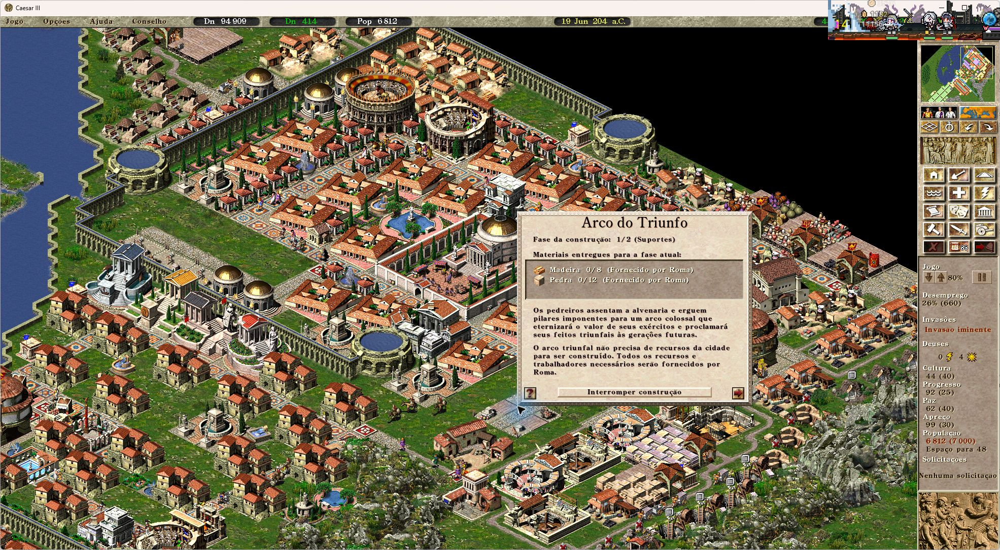

# Augustus #1827 — validation evidence

Patch: `876d5c9c8`, based on Augustus `6d6baad28`.
Tested on Windows x64/MSVC, 2026-09-21.

## Automated checks on the independent Augustus patch

| Check | Before | After (Debug) | After (Release) |
| --- | --- | --- | --- |
| Production menu/reward logic, 12 assertions | 3 failures | 12 passed | 12 passed |
| Public issue save and four additional Mediolanum saves | Menu unavailable in all five | All five passed | All five passed |

The attached logs record the behavior assertions. The five input saves reported
`arch_allowed=0, awarded=1, placed=0, victories=1`. Production save decoders and
menu logic were used. These automated checks do not load/render the full city.
No private save files are included here.

## Visual check in the Claudius integration build

The public save from [issue #1827](https://github.com/Keriew/augustus/issues/1827)
was loaded in the full game, using Claudius `4.0.0.1532-59989bf96` (Windows x64
Release/SDL2, AV1 disabled), which contains the same menu fix.

1. The government menu offered the earned triumphal arch.
2. Selecting it and placing it on empty ground created the construction site.
3. The information window identified the arch at phase 1/2 (Supports), with
   materials supplied by Rome.
4. The menu stopped offering another arch once the single reward was consumed.
5. The city was saved to a new file and reloaded; the arch site remained present.
6. Decoding that saved file confirmed
   `arch_allowed=0, awarded=1, placed=1, victories=1`; menu eligibility matched
   the exhausted reward balance. The scenario permission was not rewritten.

The visual test used Claudius, not a standalone Augustus executable. The
independent Augustus patch was checked by the automated Debug/Release tests.
We did not wait for both construction phases to finish or test audio, AV1 or OBS.
Formula ID mismatch messages were recorded during initial loading and reloading;
a text ID mismatch was also recorded during reloading. They did not prevent the
specific flow above; their cause was not investigated or fixed by this patch.
The game exited with code 0. The original save and streaming profile were
preserved, and shared preferences were restored and verified.

## File identities

- Original public save, SHA256: `3CF34648E845D88EA58530AF3B078940043C0BEF56461ACCB92B5D3B58540DC6`.
- Newly saved test city, SHA256: `116D28521A5F30B5766779F64A00D3BEA2D22F42CCFDE999A3B5B5571DFABC0C`.
- Claudius test executable, SHA256: `E8B16DEE6169E956A793F43B1E7EC59FF6B9E0A949FC45B5BE1CFE5BB560A881`.

This evidence branch is separate from the upstream patch; no tests, saves,
screenshots or auxiliary CI are included in the upstream PR diff.